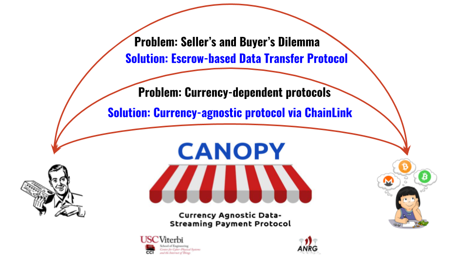

# Canopy
**C**urrency **A**g**NO**stic data **P**a**Y**ment protocol for data and service marketplaces

# What it does
Canopy is a currency agnostic data payment protocol for data and service marketplaces. Our protocol enables the sellers to sell data or service in exchange for payments in any desired currency. While Canopy uses Ethereum as the underlying transaction currency, it is not tied to any particular currency in terms of value. In addition, the protocol guarantees reliable data exchange through a novel data streaming mechanism.

# How we built it
Canopy is developed on Ethereum and Chainlink. The core functionalities of the Canopy protocol is written as a smart contract to handle the interactions between the sellers and the buyers in a trustless setup. Chainlink node acts as an oracle, and it helps Canopy to convert and adjust the payment based on the current market value of the selected currency. Also, Chainlink, along with exchange platforms such as CoinBase, exposes necessary hooks to enable cross-currency transactions to enable currency-agnostic data streaming for the IoT and Smart Cities.

# Challenges we ran into
Our team encountered a few challenges during the development of the Canopy protocol. A trustless oracle was essential to reliably convert the user-specified fee to a suitable currency based on the current market value. Delegating the currency conversion to a seller allows the seller to do the conversion in his favor to make bigger gains. We solved this problem using ChainLink's decentralized oracle. Also, we ran into the seller's and buyer's dilemma, wherein the seller may receive the money from the buyer without selling the data, or the buyer may receive the data from the seller and leave without paying for the data. We resolved this problem using an escrow mechanism in combination with a novel data streaming mechanism.

# Accomplishments that we're proud of
The data marketplaces are gaining traction in domains such as IoT, smart cities, machine learning, and artificial intelligence. All these marketplaces are created under the premise of "data or service for value" model. A tight coupling between the marketplaces and a cryptocurrency forces the user to open up accounts in multiple cryptocurrency platforms. Also, the data product's price fluctuates regularly when the price is described in the cryptocurrency supported by the marketplace platform, which arbitrarily changes the value of the data and in turn, reduces value for the user. We are incredibly proud of our currency-agnostic payment protocol as it encourages the sellers and buyers to seamlessly transact and earn incentives using the currency of their choice.

# What we learned
Through this project, we acquired a lot of new skills, including hands-on experience with Chainlink. We also used the opportunity to strengthen our protocol and dapp development skills on Ethereum and Solidity.

# What's next for CANOPY
We believe Canopy has a potential to disrupt the marketplace platforms. As a next step, we will apply the Canopy protocol on a decentralized data marketplace, and test it in real-world scenarios. We also have some exciting ideas to implement once ChainLink moves forward in it's development roadmap.

# Platform's Used
* ChainLink
* Solidity
* Ethereum
* Python
* NodeJS

# Getting Started
### Step 1 ###
Deploy the Canopy smart contract to the Ethereum platform. Make sure the ChainLink credentials (such as node id and link contract address) are correctly configured (see Step 2).

### Step 2 ###
The Canopy smart contract interacts with the ChainLink contract to fetch the necessary source of information. Please refer the following documentation for more information: [ChainLink Documentation](https://docs.chain.link/docs).

### Step 3 ###
Once the Canopy and ChainLink contracts are active, the system is ready to process transactions between sellers and buyers.

### Step 4 ###
Start the seller and buyer scripts to visually see the behavior of the Canopy protocol.

# Supported By
[USC Viterbi Center for Cyber Physical Systems and the Internet of Things](cci.usc.edu) and [Blockchain @ USC](blockchain.usc.edu).
